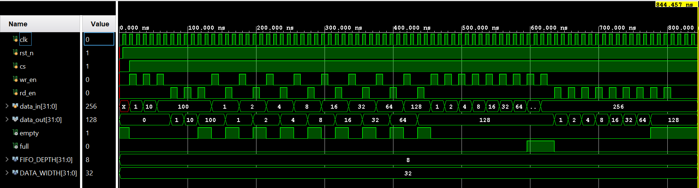

**FIFO Memory Design using Verilog in Xilinx Vivado**

**Overview**

This project implements a **synchronous FIFO (First-In First-Out) memory** using Verilog HDL and verifies its functionality through simulation and timing analysis in Xilinx Vivado.

The design demonstrates key digital design concepts such as:

* Sequential logic design
* Memory interfacing using Block RAM (BRAM)
* Timing analysis (setup & hold)
* Hardware-oriented RTL design

**Features**

* Parameterized FIFO depth and width
* Separate **read and write pointers**
* FIFO status flags:
  * Full
  * Empty
* Efficient memory implementation using **BRAM (RAMB18E1)**
* Fully synchronous design (single clock)
* Timing-verified (Setup and Hold constraints met)

**Architecture**

The FIFO consists of:
* Write Pointer Logic
* Read Pointer Logic
* Control Logic (Full/Empty detection)
* Memory Block (BRAM-based storage)

**Tools Used**

* **Xilinx Vivado** – Design, synthesis, and implementation
* **Verilog HDL** – RTL design
* **Testbench Simulation** – Functional verification

**Timing Analysis Summary**

| Parameter         | Value     | 
| ----------------- | --------- |
| Setup Slack (WNS) | +6.756 ns |
| Hold Slack (WHS)  | +0.094 ns | 
| Pulse Width Slack | +4.5 ns   | 

**Simulation**

The FIFO was verified using a testbench with:

* Write and read operations
* Boundary conditions (Full/Empty)
* Continuous data flow

Waveforms confirm correct FIFO behavior.
